## 通道绑定作用
Channel bonding：通道绑定。SerDes每个通道如果不是完全等长，那么不同通道的数据的到达时间就不同。通道绑定就是用来消除通道间的数据偏移。设置channel bonding后，gtx/gth将会同时发送channel bonding character（or a sequence of character），接收通道在接收到后便可以借此调整通道间的数据偏移。
RX channel bonding只支持8B/10B编码。
因为channel bonding需要使用RX弹性缓冲，所以需要启用RX buf。
启用改功能的步骤如下：
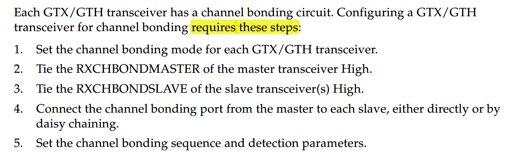

对于一组绑定的通道，只有一个master，其他的都是slave。
Connecting channel bonding ports：需要将master通道的RXCHBONDO和其他的slave通道的RXCHBONDI端口连起来。只有处于同一列的gtx/gth才能绑定在一起。

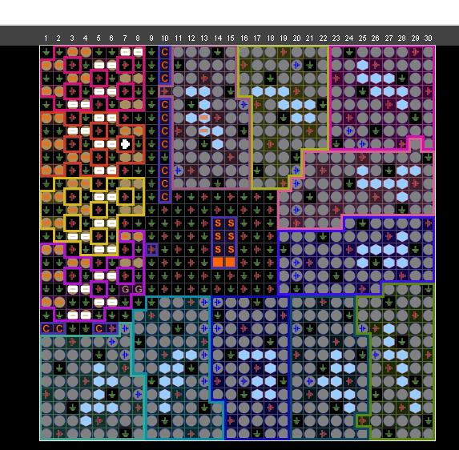

一般的设置方法为：
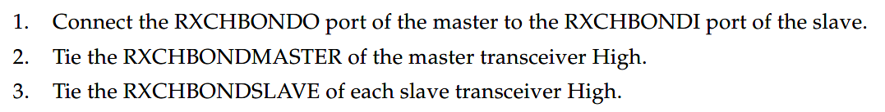

但是随着收发通道的距离越来越远，满足时序约束就越来越难。所以一般都采用菊花链的形式。下面是两种菊花链的形式。

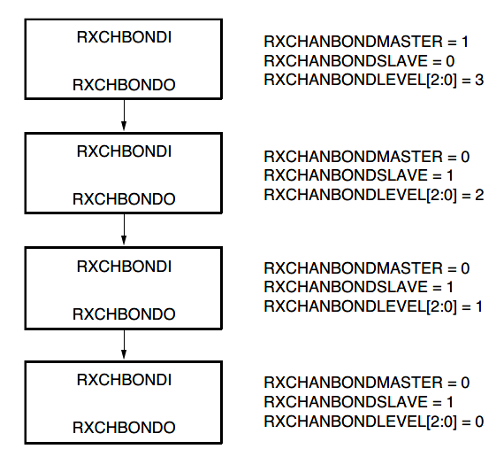

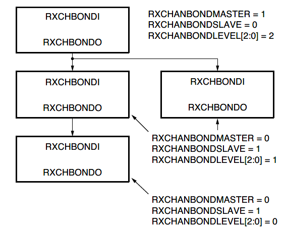

可以采用如下的方法来设置各个通道的RXCHANBONDLEVEL。

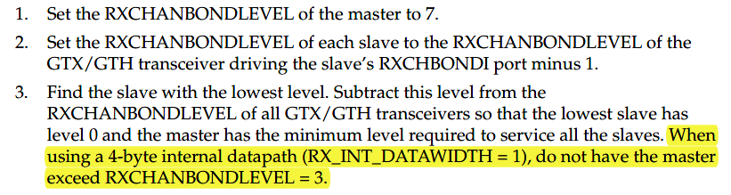

一般使用中间的SerDes通道作为master通道，两边的作为slave通道。

##Setting Channel Bonding Sequences

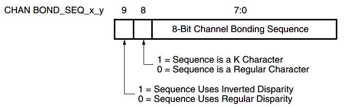

最多可以设置4个chan_bond_seq。

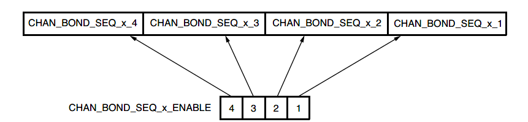

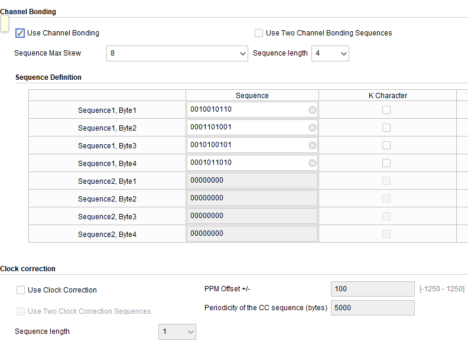

### Setting the Maximum Skew
当master通道接收到通道绑定序列后，它不会立即出发通道绑定。如果slave通道的数据有延时的时候，它就需要多等待一些绑定序列的达到，知道所有的通道都接收到了绑定序列。而CHAN_BOND_MAX_SKEW就是它将会等待多少个周期后来触发通道绑定。而RXCHANBONDLEVEL则决定了通道绑定触发后多少个周期才会执行通道绑定操作。这时候将会移动slave通道的elastic buf的指针。

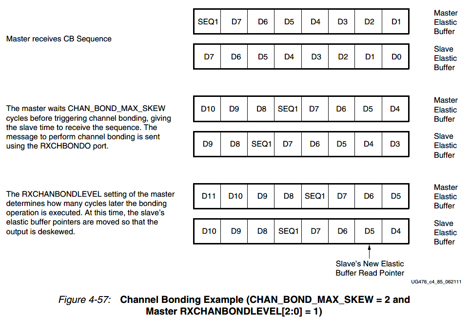

###Precedence between Channel Bonding and Clock Correction
通道绑定的原理和时钟修正的原理都是一样的。当同时设置了通道绑定和时钟修正功能时，需要确定两者的执行优先级。

仿真例子：
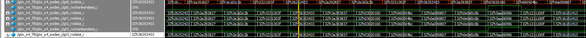

板卡PMA near-end loopback：
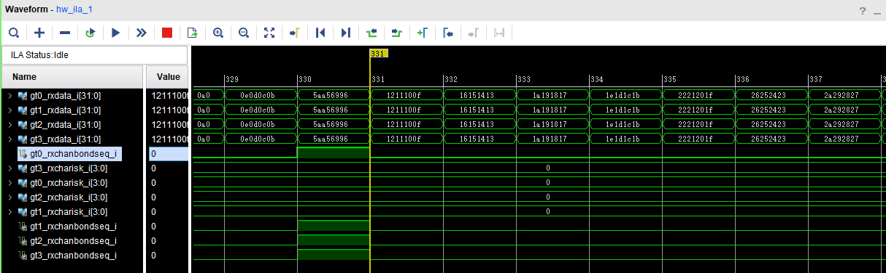

板间互传10G速率：
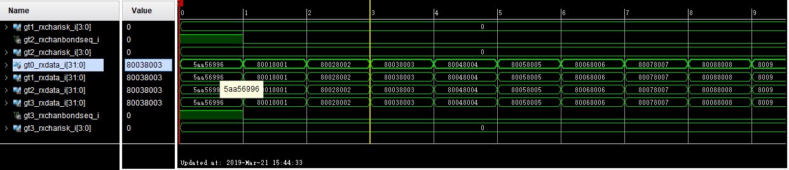