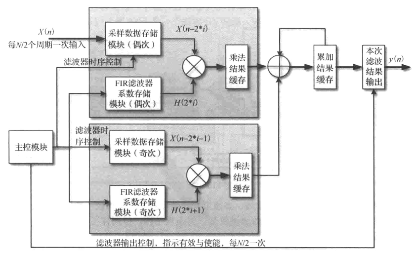

#数字滤波器设计
关于数字滤波器的一些基本概念，比如通带，阻带，过渡带等，这里边不在赘述。本文主要讨论FIR数字滤波器设计的一些设计思想和细节。  
本文主要参考了《通信IC设计》上册，以及博文[转置型FIR滤波器的fpga实现](https://blog.csdn.net/wordwarwordwar/article/details/56486841)  
文章第一次使用了公式编辑，具体编辑语法教程参考[markdown中公式编辑教程](https://www.jianshu.com/p/25f0139637b7)。该博文详细介绍了语法，但是在markdownpad2中使用需要参考[MarkdownPad 2 显示数学公式，使用MathJax](https://blog.csdn.net/qq_34243930/article/details/89158353)。  
发现无法使用$ $来编辑行内公式，参考[MarkdownPad2行内公式如何用`$$`替代`\\(\\)`---MathJax风格化配置](https://blog.csdn.net/lusongno1/article/details/82885827)。使用过程中碰到许多问题，感觉有必要专门写一篇关于markdown和markdownpad2的使用教程来进行归纳总结。   
发现如果一个公式里面出现多个下标或者上标均带有{}，就会显示不出公式。如果只有一个，就没有问题。

**注意：**公式需要在网页中打开（F6）才能正确显示，不支持LivePreview。
##1. 滤波器的基本硬件实现
###1.1. 直接型结构
直接型结构由三部分组成：数据移位寄存器，乘法器，多操作数加法器。
  
###1.2. 转置型结构
  
转置型结构，其核心思想是不直接缓存输入的数据，而是缓存输入数据与各个滤波器系数的乘积结果。相较于基本结构，首先输入数据不需要提供额外的移位寄存器；关键路径上只有一个乘法和加法，相对于直接型结构，能够缩短一定的时延。  
但是由于滤波器输入数据需要给到所有的乘法器，输入扇出较大，所以转置型不适用于阶数较大的滤波器。同时，缓存的数据变成了乘积结果，缓存数据位宽增加了。所以通常需要对数据进行截断和饱和处理。  
###1.3. 直接型和转置型的对比
直接型：适用于采样数据和系数的位宽较小，滤波器阶数较大的滤波器。  
转置型：适用于采样数据和系数的位宽较大，滤波器阶数较小的滤波器。  
###1.4. 数字滤波器的改进方向
1. 滤波器内部数据在实际使用时可以不为全精度，可以进行数据截断和四舍五入。  
2. 如果用户不需要每个周期输出一个数据，上述的设计资源就有点浪费了。  
3. 利用FIR滤波器系数的对称性
4. 如果为了提高数据处理速率，可以采用脉动型FIR滤波器.脉动型FIR滤波器是对直接型的升级，在每个操作后都加入流水线级，每个动作都打一拍，就跟心脏跳动一样，因此称为脉动型，这种结构非常适用于高速数据流的处理。与直接型结构不同的是，输入数据到下一个处理单元都需要打2拍，这是为了使乘法后的累加数据同步。  
  
##2. 滤波器硬件实现结构概述
FIR滤波器本质是对一段数据进行乘加计算，所以滤波器的设计可以约束简化为：给定M个周期输入一个数据，N个周期输出一个数据，以及约束工作频率，寻找最小的硬件实现代价。  
需要考虑三个方面：  
1. 滤波器的数据输入形式，包括初始化，流水与否，中断后如何重新输入，复位的处理等。  
2. 滤波器的系数装载方式，包括初始化，能否变更以及变更的形式等。  
3. 滤波器的乘加结构如何实现，包括乘法器的数量，乘法结构的保存位置，系数的简化和合并，是否采用DA算法等。  
最终FIR滤波器的硬件结构可分为：  
1. 基于乘法器结构的FIR滤波器  
- 基于串行乘累加结构  
- 基于并行乘法器直接型结构  
- 基于并行乘法器转置型结构  
- 基于并行乘法器脉动型结构  
- 基于乘法器的半并行结构  
2. 基于分布式算法的FIR滤波器  
- 串行分布式  
- 并行分布式  
- 串并结合分布式  
###2.1.1 基于串行累加  
特点：采用单个乘加结构完成滤波运算，每N个周期处理一次滤波数据。与全并行滤波器可以认为是同一硬件的折叠和展开两种形态。  
###2.1.2 基于并行乘法器直接型结构   
与直接型的差异主要在于对乘法结果缓存占用位宽的处理，实现该结构的关键在于如何对乘法结构进行截位和缓存。
###2.1.3 基于并行乘法器脉动型结构  

脉动阵列的通用定义在《VLSI Array Processing》中定义：  
1. 同步性：数据按节奏计算，并通过网络传输。  
2. 模块性与规则性：阵列由模块化的处理单元组成，单元之间互相连接，阵列可以被无线扩展。  
3. 时空局部性：空间局部化，阵列意味着一个局部化的通信互联结构；时间局部化，至少有一个单元时间延迟被共享，以便信号从一个节点传输到下一个节点。  
4. 流水线性：阵列具有流水线结构。   
脉动型FIR滤波器是对直接型的升级，在每个操作后都加入流水线级，每个动作都打一拍，就跟心脏跳动一样，因此称为脉动型，这种结构非常适用于高速数据流的处理。
采用Xilinx FPGA中的DSP48E1 实现，基本处理单元中的操作都可在一个DSP48E1中完成，输入数据经过DSP48E1中寄存2拍后通过ACOUT输出，直接连接到下一个 DSP48E1中的ACIN端口，累加输出PCOUT直接连接到下一个DSP48E1中的PCIN端口，这些连接都没有经过FPGA的Fabric连线逻辑，而是通过DSP Block的内部走线连接，这样实现能够缩短路径的延时。  
对于系数对称的滤波器而言，可以通过延时将系数相同的两个数据先进行加法运算，然后在和同一个系数进行乘法运算，这样便可以节约一半的乘法器资源。

###2.1.4 基于乘法器的半并行结构  
该结构实质上是通过合理安排时序，在满足吞吐率的要求下，实现多个乘加单元的复用，比如有两个乘加结构，而滤波器的阶数为N，可以采用如下图的半并行结构。相当于串行结构和全并行结构的一个折中。  

###2.2.1 串行分布式
DA（distributed arithmetic）算法推导：  
滤波器表示为：$y=\sum_{k=0}^{N-1}A_kX_k $,其中$A_k$是滤波器系数，$X_k$是输入变量，N是内积次数。

对于二进制无符号数:$X_k=\sum_{i=0}^{B-1}x_{k,i}2^i$ (这里公式求和符号下标应该是i=0)。其中$x_{k,i}$是$X_k$的第i位二进制数，B是$X_k$的位数。    
如果是二进制补码表示的有符号数，那么$X_k=-2^{B-1}x_{k,B-1}+\sum_{i=0}^Bx_k2^i$

  

  

