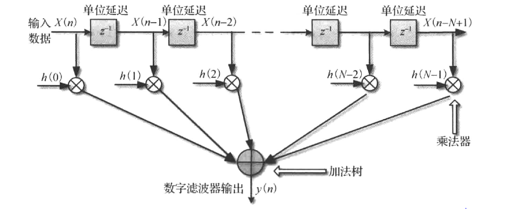

#数字滤波器设计
关于数字滤波器的一些基本概念，比如通带，阻带，过渡带等，这里边不在赘述。本文主要讨论FIR数字滤波器设计的一些设计思想和细节。  
本文主要参考了《通信IC设计》上册，以及博文[转置型FIR滤波器的fpga实现](https://blog.csdn.net/wordwarwordwar/article/details/56486841)
##1. 滤波器的基本硬件实现
###1.1. 直接型结构
直接型结构由三部分组成：数据移位寄存器，乘法器，多操作数加法器。
  
###1.2. 转置型结构
  
转置型结构，其核心思想是不直接缓存输入的数据，而是缓存输入数据与各个滤波器系数的乘积结果。相较于基本结构，首先输入数据不需要提供额外的移位寄存器；关键路径上只有一个乘法和加法，相对于直接型结构，能够缩短一定的时延。  
但是由于滤波器输入数据需要给到所有的乘法器，输入扇出较大，所以转置型不适用于阶数较大的滤波器。同时，缓存的数据变成了乘积结果，缓存数据位宽增加了。所以通常需要对数据进行截断和饱和处理。  
###1.3. 直接型和转置型的对比
直接型：适用于采样数据和系数的位宽较小，滤波器阶数较大的滤波器。  
转置型：适用于采样数据和系数的位宽较大，滤波器阶数较小的滤波器。  
###1.4. 数字滤波器的改进方向
1. 滤波器内部数据在实际使用时可以不为全精度，可以进行数据截断和四舍五入。  
2. 如果用户不需要每个周期输出一个数据，上述的设计资源就有点浪费了。  
3. 利用FIR滤波器系数的对称性
4. 如果为了提高数据处理速率，可以采用脉动型FIR滤波器.脉动型FIR滤波器是对直接型的升级，在每个操作后都加入流水线级，每个动作都打一拍，就跟心脏跳动一样，因此称为脉动型，这种结构非常适用于高速数据流的处理。与直接型结构不同的是，输入数据到下一个处理单元都需要打2拍，这是为了使乘法后的累加数据同步。  
  
##2. 滤波器硬件实现结构概述
FIR滤波器本质是对一段数据进行乘加计算，所以滤波器的设计可以约束简化为：给定M个周期输入一个数据，N个周期输出一个数据，以及约束工作频率，寻找最小的硬件实现代价。  
需要考虑三个方面：  
1. 滤波器的数据输入形式，包括初始化，流水与否，中断后如何重新输入，复位的处理等。  
2. 滤波器的系数装载方式，包括初始化，能否变更以及变更的形式等。  
3. 滤波器的乘加结构如何实现，包括乘法器的数量，乘法结构的保存位置，系数的简化和合并，是否采用DA算法等。  
最终FIR滤波器的硬件结构可分为：  
1. 基于乘法器结构的FIR滤波器  
- 基于串行乘累加结构  
- 基于并行乘法器直接型结构  
- 基于并行乘法器转置型结构  
- 基于并行乘法器脉动型结构  
- 基于乘法器的半并行结构  
2. 基于分布式算法的FIR滤波器  
- 串行分布式  
- 并行分布式  
- 串并结合分布式  

